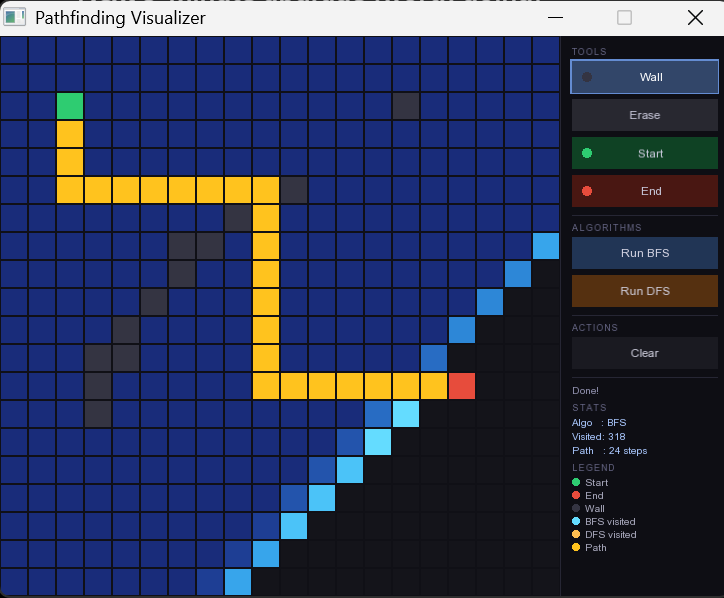
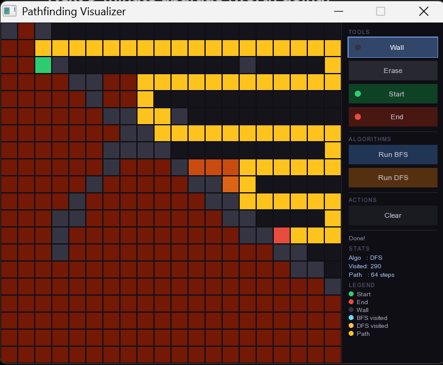

# Pathfinding Visualizer

Interactive Pathfinding Visualizer built using C++ and SFML.

## Features

- BFS Visualization
- DFS Visualization
- Interactive Grid
- Path Tracing
- Real-Time Statistics

## Screenshots

### BFS

### DFS

